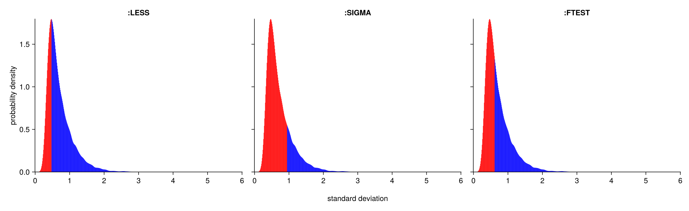
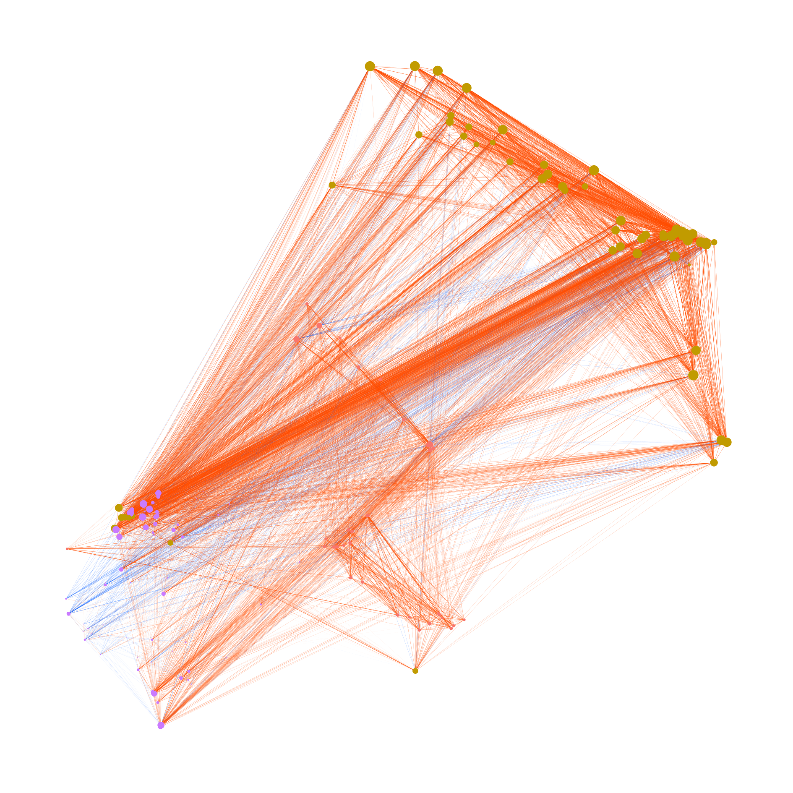
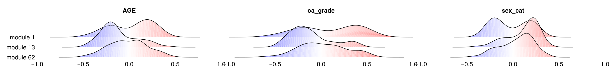

```@meta
CurrentModule = SGCRNAs
```

```@index
```

cd("code/SGCRNAs")
activate .
cd("../../GSE114007")
Data = CSV.read("Result/Norm/normalizedCounts_coding.tsv", header=1, comment="#", delim='\t', DataFrame);

# Tutorial
In this tutorial, we use the dataset [GSE114007](https://www.ncbi.nlm.nih.gov/geo/query/acc.cgi?acc=GSE114007), as described in the SGCRNA publication.
- [RNA expression matrix](assets/normalizedCounts_coding.tsv)
- [clinical data](assets/SraRunTable.csv)

## 1. Preparation
Load the required packages and files.
```julia
using CSV, DataFrames
using SGCRNAs

# Load Data
Data = CSV.read("normalizedCounts_coding.tsv", header=1, comment="#", delim='\t', DataFrame);
Phen = CSV.read("SraRunTable.csv", header=1, comment="#", delim=',', DataFrame);
```

## 2. Pre-processing
Preprocessing of the data is performed using the CGM function.  
The first argument takes a vector of variable names, and the second argument takes a matrix of values. The value matrix must have variables as rows and samples as columns.  
An optional argument, `mode` (default: `:NONE`), can be set to `:LESS`, `:SIGMA`, or `:FTEST`. If any of these modes are specified, a plot will be generated and saved in the current directory, with the range of values to be removed highlighted in red. Regardless of which mode is selected, all modes other than `:NONE` will be included in the output figure.
```julia
CorData, GradData = CGM(Data.Symbol, Matrix(Data[:,5:end]), mode=:FTEST);
```

`CorData` is a DataFrame representing the correlation matrix, and `GradData` is a DataFrame representing the regression coefficient matrix.


## 3. Clustering
Clustering is performed using the results obtained in the previous step.  
In general, it is not necessary to change the optional arguments. However, if the number of variables is small, consider reducing the values of tNodeNum (default: 100) and pcas (default: 99). It is recommended that both values be set to less than approximately one-tenth of the total number of variables, but no less than 3.
```julia
clust, pos, edge_data = SpectralClustering(CorData, GradData);
```
The clustering results are stored in `clust`.  
Due to the sub-clustering process performed according to the conditions specified by the optional arguments of the function — `tNodeNum` (default: 100, the maximum number of nodes in a module) and `depthMax` (default: 5, the maximum number of sub-clustering iterations) — the results are returned as a vector of vectors.
In most cases, you can simply use the vector at index 1. However, if you wish to perform more fine-grained clustering, you may use other elements as well.

## 4. Draw Network
Specify the modules you wish to visualise using `SetNetwork`, and draw the network graph with `DrawNetwork`. By passing a vector of module numbers to the optional argument `il` in `SetNetwork`, only the specified modules will be displayed. If `il` is not specified, all modules will be drawn.
```julia
d = 1; k = maximum(clust[d]);
nw, new_pos, cnctdf, new_clust, score = SetNetwork(edge_data, clust[d], pos, il=[1,13,62]);
DrawNetwork("Result/Fig/NetWork.png", nw, new_pos, cnctdf, new_clust, k, node_scores=score);
```


## 5. Correlation Between Modules and Phenomena
By comparing the modules with other parameters associated with the samples, it is possible to investigate which modules are related to specific parameters. In this example, the parameters include sex, osteoarthritis grade, and age.  
It is important to note that, unlike the expression matrix, the parameter data is structured with samples as rows and parameters as columns.  
Naturally, the order of the samples (i.e., the column order in the expression matrix) must match the order of the samples in the parameter data.
```julia
Data = innerjoin(Data, DataFrame(Symbol=unique(vcat(cnctdf.e1,cnctdf.e2))), on=:Symbol, order=:right);
CorPhenMod(Data[:,5:end], Phen[:,[2,3,5]], new_clust, "Result/Fig/CorPhenMod.png");
```
